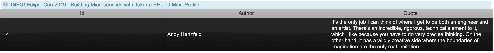

# Building Microservices with Jakarta EE and MicroProfile

# Assignments EclipseCon 2019

## Part 1: Containerized builds and deployments of Payara Application Server runtimes
The first part of this tutorial will show you how to build Jakarta EE enterprise applications, complemented with MicroProfile for microservices support. The application is a simple “Quote of the Day” showcase, that consists of three services fulfilling their own purpose. All three services will be built and deployed on their own variant of Payara runtime, while showing that the Jakarta EE and MicroProfile programming models don’t change!

### Getting Started
Make sure you have prepared this tutorial by following these instructions:

- [Preparation Instructions](http://ivo2u.nl/oc)
- Import the pom.xml in the root folder as Maven project in your IDE. Verify that you have imported these three projects:
  - application-server-project
  - hollow-jar-project
  - uber-jar-project

### Assignment 1: Run an application on an application server runtime (Payara Server Full)
This project covers the following Jakarta EE and MicroProfile components:
- JAX-RS
- CDI
- JPA
- JSON-B

Navigate to the application-server-project:
```bash
cd application-server-project
```

Add the following dependencies to the pom.xml in this project in order to make it a Jakarta EE 8 Full Profile and MicroProfile 2.2 compatible application:
```xml
<dependency>
   <groupId>jakarta.platform</groupId>
   <artifactId>jakarta.jakartaee-api</artifactId>
   <version>8.0.0</version>
   <scope>provided</scope>
</dependency>
<dependency>
   <groupId>org.eclipse.microprofile</groupId>
   <artifactId>microprofile</artifactId>
   <version>2.2</version>
   <type>pom</type>
   <scope>provided</scope>
</dependency>
```

---
**Note:** Payara Server Full 5.193 implements both Jakarta EE 8 and MicroProfile 2.2, so matching these dependencies ensures compatibility of your app and the application server runtime.

---

Build the project with Maven:
```bash
mvn package
```

Build the Docker image with the application-server-project.war artifact on it:
```bash
docker build -t application-server-project .
```

Run the application in Docker (add the -d parameter for detached mode):
```bash
docker-compose up --build
```

---
**Note:** This command will spin up a Docker container, which starts the Payara application server as a Java process that deploys your app on it.

---

Open the following URL with a browser or HTTP client to get a random Quote form the running application:
```bash
http://localhost:8080/application-server-project/rest/quotes/random
```
The output should be similar to:
```json
Hello EclipseCon 2019!
```

In order to retrieve random Quotes, replace the getRandomQuote() method in the QuoteQueries class:
```java
  @GET
  @Path("/random")
  public Response getRandomQuote() throws Exception {
      return Response.ok("Hello EclipseCon 2019!").build();
  }
```

with:
```java
@GET
@Path("/random")
public Response getRandomQuote() throws Exception {
  // Simulate flaky behaviour
  final long randomId = Double.valueOf(Math.random() * 10d).longValue();

  if ((0L <= randomId) && (4L > randomId)) {
     throw new RuntimeException("Random exception from Quote backend");
  }
  if ((4L <= randomId) && (6L > randomId)) {
     Thread.sleep(10000);
  }
  return Response.ok(this.quotes.getRandomQuote()).build();
}
```

---
**Note:** This method adds some flaky behaviour to this service that is later being handled by another service. To deploy these changes on the running application server, run the following command to rebuild the WAR and have it being picked up and redeployed by the application server.

---

Rebuild the project with Maven:
```bash
mvn package
```

---
**Note:** this will result in the WAR being replaced in the artifact folder that is being monitored by the running application server.

---

If you call the former URL again:
```bash
http://localhost:8080/application-server-project/rest/quotes/random
```

The output should be similar to:
- a very slow response, possibly even resulting in an error due to a timeout
- a random Server exception with HTTP status 500
- the following JSON response, containing Quote data:
```json
{
"author":"Richard Pattis","id":22,"quote":"When debugging, novices insert corrective code; experts remove defective code. "
}
```

---
**Note:** feel free to refresh this URL to experience the various results.

**Note:** If the redeploy doesn’t seem to work, clear or remove the “artifact” folder and all it’s deployment information, and try the former steps again

---

Shut down your running Docker containers in order to finish this assignment:
```bash
docker-compose down -v
```

### Assignment 2: Run an application as a Hollow JAR runtime (Payara Micro)
This project covers the following MicroProfile components:
- JAX-RS
- MicroProfile RestClient
- MicroProfile FaultTolerance
  - Retry
  - Fallback
  - Timeout

Navigate to the hollow-jar-project:
```bash
cd hollow-jar-project
```

Add the following dependencies to the pom.xml in this project in order to make it a Jakarta EE 8 Web Profile and MicroProfile 2.2 compatible application:
```xml
<dependency>
   <groupId>jakarta.platform</groupId>
   <artifactId>jakarta.jakartaee-web-api</artifactId>
   <version>8.0.0</version>
   <scope>provided</scope>
</dependency>
<dependency>
   <groupId>org.eclipse.microprofile</groupId>
   <artifactId>microprofile</artifactId>
   <version>2.2</version>
   <type>pom</type>
   <scope>provided</scope>
</dependency>
```

---
**Note:** the “web” profile is needed here because Payara Micro supports this profile, and not the “full” Profile

---

Open the QuoteQueries class in the project and replace the:
```java
  @GET
  @Path("/random/backend")
  public Response getRandomQuote() throws Exception {
      return Response.ok("Hello EclipseCon 2019!").build();
  }
```

with:
```java
 @GET
 @Path("/random/backend")
 @Retry
 @Fallback(fallbackMethod = "fallback")
 @Timeout(2000)
 public Response getRandomQuote() {
    return Response.ok(quotesBackendClient.getRandomQuoteFromBackend()).build();
 }
```

---
**Note:** this method is annotated with MicroProfile FaultTolerance features to mitigate the flaky behaviour of the application-server-project REST endpoint which it communicates with.

---

Build the project with Maven:
```bash
mvn package
```

Build the Docker image:
```bash
docker build -t hollow-jar-project .
```

Run the application in Docker (add the -d parameter for detached mode):
```bash
docker-compose up --build
```

---
**Note:** This command will spin a Docker container, which starts the Hollow JAR as a Java process that points to your app that will be deployed on it.

---

Open the following URL with a browser or HTTP client to get a random Quote form the running application:
```bash
http://localhost:9090/hollow-jar-project/rest/quotes/random/backend
```

The output should be similar to the following JSON response:
```json
{
"author":"Richard Pattis","id":22,"quote":"When debugging, novices insert corrective code; experts remove defective code. "
}
```

---
**Note:** this output is retrieved from a call to the already running backend application-server-project via the hollow-jar service

---

Shut down your running Docker containers in order to finish this assignment:
```bash
docker-compose down
```

### Assignment 3: Run an application as a Uber JAR rntime (Payara Micro)
This project covers the following Jakarta EE and MicroProfile components:
- JSF
- CDI
- MicroProfile RestClient

Navigate to the uber-jar-project:
```bash
cd uber-jar-project
```

Add the following dependencies to the pom.xml in this project in order to make it a Jakarta EE 8 Web Profile and MicroProfile 2.2 compatible application:
```xml
<dependency>
   <groupId>jakarta.platform</groupId>
   <artifactId>jakarta.jakartaee-web-api</artifactId>
   <version>8.0.0</version>
   <scope>provided</scope>
</dependency>
<dependency>
   <groupId>org.eclipse.microprofile</groupId>
   <artifactId>microprofile</artifactId>
   <version>2.2</version>
   <type>pom</type>
   <scope>provided</scope>
</dependency>
```

---
**Note:** the “web” profile is needed here because Payara Micro supports this profile, and not the “full” Profile

---

Also, add the JSF component library “PrimeFaces” dependencies to generate a GUI based on JSF components:
```xml
<dependency>
   <groupId>org.primefaces</groupId>
   <artifactId>primefaces</artifactId>
   <version>7.0</version>
</dependency>
<dependency>
  <groupId>org.primefaces.themes</groupId>
  <artifactId>all-themes</artifactId>
  <version>1.0.10</version>
</dependency>
```

To create the JSF based GUI, add the following XHTML to the index.xhtml file in this project:
```html
<!DOCTYPE html>
<html lang="en"
  xmlns="http://www.w3.org/1999/xhtml"
  xmlns:h="http://xmlns.jcp.org/jsf/html"
  xmlns:a="http://xmlns.jcp.org/jsf/passthrough"
  xmlns:p="http://primefaces.org/ui"
>
  <h:head>
     <title>Uber JAR example: Payara 5.193</title>
  </h:head>
  <h:body>
     <p:staticMessage severity="info" summary="INFO!" detail="EclipseCon 2019 - Building Microservices with Jakarta EE and MicroProfile" />
     <p:outputLabel ></p:outputLabel>
     <p:dataTable var="quote" value="#{quoteQueries.randomQuotes}">
        <p:column headerText="Id">
           <h:outputText value="#{quote.id}" />
        </p:column>
 
        <p:column headerText="Author">
           <h:outputText value="#{quote.author}" />
        </p:column>
 
        <p:column headerText="Quote">
           <h:outputText value="#{quote.quote}" />
        </p:column>
     </p:dataTable>
  </h:body>
</html>
```

---
**Note:** The namespaces xmlns:h, xmlns:a and xmlns:p provide access to the JSF components that are defined here. Have a look at what else is avaliable! In case you are interested, you can start here: https://www.primefaces.org/showcase/.

---

Build the project with Maven:
```bash
mvn install
```

---
**Note:** this command will download payara-micro:5.193 via Maven. In case this is not working, you can alternatively place payara-micro-5.193.jar from the preparations in the root of the uber-jar-project and run the following commands:
```bash
mvn package
```
java -jar payara-micro-5.193.jar --deploy target/uber-jar-project.war --outputUberJar target/uber-jar-project-microbundle.jar

---

Build the Docker image with the Uber JAR on it:
```bash
docker build -t uber-jar-project .
```

---
**Note:** you may notice that it takes longer to replace the relatively large Uber JAR on the layer of the Docker image. Replacing only the small WAR files on the Docker images like it is done in the former examples is much faster and more efficient. Using an Uber JAR therefore makes the least sense in the context of development .

---

Run the application in Docker (add the -d parameter for detached mode):
```bash
docker-compose up --build
```

---
**Note:** this command will spin up a Docker container, which starts the Uber JAR as a Java process that contains both the app and Payara Micro.

---

Open the following URL with a browser or HTTP client to get a random Quote form the running application:
```bash
http://localhost:7070/rest/quotes/random/microservice
```
or
```bash
http://localhost:7070/uber-jar-project/rest/quotes/random/microservice
```

---
Note: it can apparently vary on which of the former URL's the Uber JAR will be deployed. Therefore, these two options are given where one should match for your situation. 

---

The output should be similar to the following JSON response:
```json
{
"author":"Richard Pattis","id":22,"quote":"When debugging, novices insert corrective code; experts remove defective code. "
}
```

---
**Note:** this output is retrieved from a call to the already running intermediate microservice hollow-jar-project

---

You can also open the JSF GUI via:
```bash
http://localhost:7070/
```
or
```bash
http://localhost:7070/uber-jar-project/
```

The visual output should be similar to the following:


Shut down your running Docker containers in order to finish this assignment:
```bash
docker-compose down
```

## Part 2: Cloud - local setup
This part will cover deploying the former setup from Part 1 in Minikube. Before you start, make sure you have shut down all running (Docker) services on every project with:
```bash
docker-compose down
```

### Assignment 4: Run the application-server-project in Minikube
Open a terminal and start the Kubernetes dashboard:
```bash
minikube dashboard
```

---
**Note:** this command will open the Kubernetes dashboard in a browser. 

---

Open a new terminal and start minikube:
```bash
minikube start
```

Reuse the docker daemon inside Kubernetes:
```bash
eval $(minikube docker-env)
```

Deploy the database to Kubernetes:
```bash
cd application-server-project

kubectl apply -f kubernetes/mysql.yml
```

---
**Note:** this command deploys the mysql service to Kubernetes. This can be seen in the Kubernetes dashboard (in your browser). You should see a Deployment, Pod, Replica Set, and a Service with a name similar to MySQL.

---

Build the project with Maven:
```bash
mvn package
```

Build the Docker image:
```bash
docker build -t application-server-project .
```

Deploy this service to Kubernetes:
```bash
kubectl apply -f kubernetes/application-server-project.yml
```

Open the exposed endpoint of this service in your browser:
```bash
minikube service application-server-project
```

---
**Note:** the last command opens the application-server-project in your browser (don’t worry about the ‘This site can’t be reached’ message, or if you land at the default Payara welcome page. Append ‘/application-server-project/rest/quotes/random’ at the end of the URL in your browser, to get a response from this endpoint.

---

### Assignment 5: Run the hollow-jar-project in Minikube and connect it to the application-server-project
Build and deploy the hollow-jar-project:
```bash
cd hollow-jar-project
```

Build the project with Maven:
```bash
mvn package
```

Build the Docker image:
```bash
docker build -t hollow-jar-project .
```

Deploy this service to Kubernetes:
```bash
kubectl apply -f kubernetes/hollow-jar-project.yml
```

Open the exposed endpoint of this service in your browser:
```bash
minikube service hollow-jar-project
```

---
**Note:** the last command opens the hollow-jar-project in your browser (don’t worry about the ‘This site can’t be reached’ message. Append ‘/hollow-jar-project/rest/quotes/random/backend’’ at the end of the URL in your browser, to get a response from this endpoint that calls the application-server-project service to get its data.

---

### Assignment 6: Run the uber-jar-project in Minikube and connect it to the hollow-jar-project

Build and deploy the hollow-jar service:
```bash
cd uber-jar-project
```

Build the project with Maven:
```bash
mvn install
```

Build the Docker image:
```bash
docker build -t uber-jar-project .
```

Deploy this service to Kubernetes:
```bash
kubectl apply -f kubernetes/uber-jar-project.yml
```

Open the exposed endpoint of this service in your browser:
```bash
minikube service uber-jar-project
```

---
**Note:** the last command opens the uber-jar-project in your browser (don’t worry about the ‘This site can’t be reached’ message. Otherwise it is likely that it will show the JSF GUI since this is deployed on the root context "/". If you want to access the REST endpoint, append ‘/rest/quotes/random/microservice’ at the end of the URL in your browser, to get a response from this endpoint that calls the hollow-jar-project service to get its data.

## Part 3: Scaling
This part will show how to scale your applications in order to handle increased traffic. It also shows how to do zero downtime deployments. Zero downtime deployments enable you to deploy your changed application, without impact on the user experience. Users will not notice that a new application is being deployed, because there will be no downtime!

### Assignment 7: Scale the uber-jar-project in Minikube
Scale the number of replicas of the uber-jar-project to 2:
```bash
kubectl scale deployments/uber-jar-project --replicas=2
```

Open the dashboard in your browser. You should see that the number of pods of the uber-jar-project is 2.

### Assignment 8: Zero downtime deployment
In order to make it a visible change, you need to change the theme of the uber-jar-project. Change the value of the context-param primefaces.THEME from vader to bootstrap in the web.xml file.
Change the following

```xml
<context-param>  
  <param-name>primefaces.THEME</param-name>
  <param-value>vader</param-value>  
</context-param>
```
to

```xml
<context-param>  
  <param-name>primefaces.THEME</param-name>
  <param-value>bootstrap</param-value>
</context-param>
```

Rebuild the project with Maven:
```bash
mvn clean install
```

Build the Docker image:
```bash
docker build -t uber-jar-project:v2 .
```

Deploy:
```bash
kubectl set image deployments/uber-jar-project uber-jar-project=uber-jar-project:v2
```